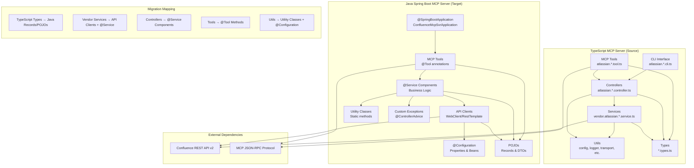

# Confluence MCP Server Migration Architecture

## Current State (TypeScript) vs Target State (Java Spring Boot)

## Feature Modules

### 1. Pages Module
**TypeScript Components:**
- `vendor.atlassian.pages.service.ts` → API client
- `atlassian.pages.controller.ts` → Business logic
- `atlassian.pages.tool.ts` → MCP tools
- `atlassian.pages.types.ts` → Data models

**Java Components:**
- `ConfluencePagesClient` → API integration
- `ConfluencePagesService` → Business logic
- `PagesToolsConfiguration` → MCP tool definitions
- `Page`, `PageDetails`, `PagesResponse` → Data models

### 2. Search Module
**TypeScript Components:**
- `vendor.atlassian.search.service.ts` → API client
- `atlassian.search.controller.ts` → Business logic
- `atlassian.search.tool.ts` → MCP tools
- `atlassian.search.types.ts` → Data models

**Java Components:**
- `ConfluenceSearchClient` → API integration
- `ConfluenceSearchService` → Business logic
- `SearchToolsConfiguration` → MCP tool definitions
- `SearchRequest`, `SearchResult` → Data models

### 3. Spaces Module
**TypeScript Components:**
- `vendor.atlassian.spaces.service.ts` → API client
- `atlassian.spaces.controller.ts` → Business logic
- `atlassian.spaces.tool.ts` → MCP tools
- `atlassian.spaces.types.ts` → Data models

**Java Components:**
- `ConfluenceSpacesClient` → API integration
- `ConfluenceSpacesService` → Business logic
- `SpacesToolsConfiguration` → MCP tool definitions
- `Space`, `SpaceDetails` → Data models

## Configuration Strategy

**TypeScript (Current):**
- Environment variables via dotenv
- Global config file at `~/.mcp/configs.json`
- Runtime config loading

**Java (Target):**
- Spring Boot application.properties
- Environment variable binding with @Value
- @ConfigurationProperties for structured config
- Profile-based configuration

## Key Technology Mappings

| TypeScript | Java Spring Boot |
|------------|------------------|
| @modelcontextprotocol/sdk | Spring AI MCP Server WebMVC |
| node-fetch | WebClient / RestTemplate |
| dotenv | @ConfigurationProperties |
| commander (CLI) | Spring Boot CommandLineRunner |
| jest | JUnit 5 + Mockito |
| turndown (HTML→MD) | CommonMark or similar |
| zod validation | Jakarta Validation |
